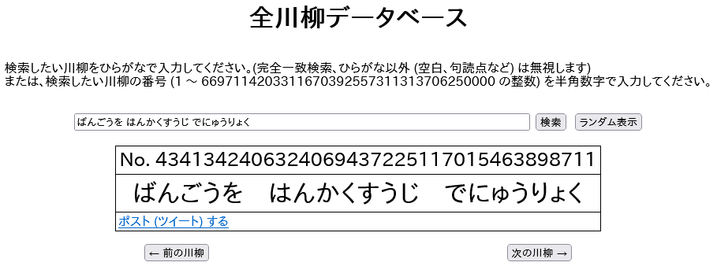

全川柳データベース
==================

[https://mikecat.github.io/all_senryu/](https://mikecat.github.io/all_senryu/)

全ての川柳を網羅したデータベースです。

川柳を指定しての完全一致検索、番号を指定しての検索、ランダム表示ができます。

元ネタ：[全俳句データベース](https://horicun.moo.jp/contents/haiku/) ([Ver.2](https://horicun.moo.jp/contents/haiku2/)) by [ほり](https://twitter.com/horicun)

元ネタの元ネタ：[Gパンパンダ コント「俳句名人」 - YouTube](https://www.youtube.com/watch?v=n4KcpTBBZjQ)
